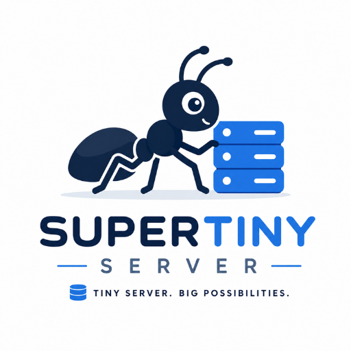

<p align="center">
  
</p>

<h1 align="center">SuperTinyServer</h1>

<p align="center">
  <b>Mini Server Berbasis Android & Termux</b><br>
  SuperTinyServer adalah mini server yang memungkinkan perangkat Android digunakan sebagai server ringan dalam jaringan lokal.
</p>

Project ini menyediakan SSH Server dan Web Dashboard yang dapat berjalan secara otomatis ketika Termux dibuka.

SuperTinyServer dirancang sebagai project eksperimen dan dapat dikembangkan menjadi portable mini homelab berbasis Android.

---

## Features

Saat ini SuperTinyServer memiliki fitur:

- SSH Server menggunakan OpenSSH
- Web Dashboard berbasis Node.js dan Express
- Automatic IP Detection
- Dynamic IP Support
- Automatic SSH Startup
- Automatic Dashboard Startup
- Automatic Browser Opening
- Server Information Display
- Portable Project Structure
- Easy Installation
- Automatic Startup Configuration

---

## Architecture

```text
Android Tablet
│
└── Termux
    │
    ├── OpenSSH
    │   └── SSH Server
    │       └── Port 8022
    │
    ├── Node.js
    │   └── Express
    │       └── Web Dashboard
    │           └── Port 3000
    │
    └── SuperTinyServer
        │
        ├── config/
        ├── scripts/
        ├── server/
        └── logs/
```

---

# Requirements

Untuk menggunakan SuperTinyServer diperlukan:

- Android Device
- Termux
- Wi-Fi atau jaringan lokal
- Git

Installer akan secara otomatis menginstall dependency berikut:

- Node.js
- OpenSSH
- Curl
- Node.js dependencies

---

# Installation

Clone repository:

```bash
git clone YOUR_REPOSITORY_URL
```

Masuk ke folder project:

```bash
cd supertinyserver
```

Jalankan installer:

```bash
./install.sh
```

Installer akan melakukan:

1. Update package Termux.
2. Install Node.js.
3. Install OpenSSH.
4. Install Curl.
5. Install Node.js dependencies menggunakan `npm install`.
6. Memberikan permission pada script.
7. Mengatur automatic startup.
8. Menjalankan SuperTinyServer.

---

# Automatic Startup

Setelah instalasi selesai, SuperTinyServer akan otomatis berjalan ketika Termux dibuka.

Urutan proses:

```text
Open Termux
    │
    ▼
Start SSH Server
    │
    ▼
Start Web Dashboard
    │
    ▼
Wait for Dashboard
    │
    ▼
Detect Local IP Address
    │
    ▼
Display Server Information
    │
    ▼
Open Dashboard Automatically
```

Contoh tampilan:

```text
Starting SuperTinyServer...

[1/3] Starting SSH Server...
[2/3] Starting Dashboard...
[3/3] Waiting for Dashboard...

╔══════════════════════════════════════════════════╗
║              SUPERTINYSERVER ONLINE              ║
╠══════════════════════════════════════════════════╣
║                                                  ║
║  DASHBOARD                                       ║
║  http://192.168.x.x:3000                         ║
║                                                  ║
║  SSH CONNECTION                                  ║
║  ssh -p 8022 username@192.168.x.x                ║
║                                                  ║
╚══════════════════════════════════════════════════╝
```

Setelah proses boot selesai, browser Android akan otomatis membuka Web Dashboard.

---

# Web Dashboard

Dashboard berjalan pada port:

```text
3000
```

Contoh akses:

```text
http://192.168.1.5:3000
```

IP address dapat berubah tergantung jaringan Wi-Fi yang digunakan.

SuperTinyServer akan mencoba mendeteksi IP address secara otomatis.

---

# SSH Access

SSH Server berjalan menggunakan port:

```text
8022
```

Untuk terhubung dari komputer:

```bash
ssh -p 8022 USERNAME@IP_ADDRESS
```

Contoh:

```bash
ssh -p 8022 u0_a319@192.168.1.5
```

Username dan IP address dapat berbeda pada setiap perangkat Android.

---

# Dynamic IP

SuperTinyServer tidak bergantung pada IP statis.

Misalnya perangkat sebelumnya mendapatkan:

```text
192.168.1.5
```

Kemudian berpindah ke jaringan lain:

```text
192.168.0.10
```

Dashboard dan informasi server akan menggunakan IP yang terdeteksi pada jaringan saat ini.

---

# Project Structure

```text
supertinyserver/
│
├── config/
│   └── config.sh
│
├── logs/
│   └── .gitkeep
│
├── scripts/
│   ├── info.sh
│   ├── start-dashboard.sh
│   ├── start-ssh.sh
│   └── start.sh
│
├── server/
│   │
│   ├── public/
│   │   ├── index.html
│   │   ├── script.js
│   │   └── style.css
│   │
│   └── server.js
│
├── install.sh
├── uninstall.sh
├── package.json
├── package-lock.json
├── .gitignore
└── README.md
```

---

# Scripts

## Start SuperTinyServer

Menjalankan seluruh service:

```bash
./scripts/start.sh
```

Service yang dijalankan:

- SSH Server
- Web Dashboard
- Server Information Display
- Automatic Browser Opening

---

## Start SSH Server

Menjalankan SSH Server:

```bash
./scripts/start-ssh.sh
```

SSH berjalan pada port:

```text
8022
```

---

## Start Dashboard

Menjalankan Web Dashboard:

```bash
./scripts/start-dashboard.sh
```

Dashboard berjalan pada:

```text
Port 3000
```

---

## Server Information

Menampilkan informasi SuperTinyServer:

```bash
./scripts/info.sh
```

Informasi yang ditampilkan:

- Dashboard URL
- IP Address
- SSH Port
- Username
- SSH Connection Command

---

# API

SuperTinyServer menyediakan API sederhana:

```text
/api/server-info
```

Contoh:

```bash
curl http://127.0.0.1:3000/api/server-info
```

Contoh response:

```json
{
  "hostname": "localhost",
  "username": "u0_a319",
  "ip": "192.168.1.5",
  "port": 8022,
  "nodeVersion": "v26.3.1",
  "platform": "Android / Termux",
  "uptime": 123456,
  "sshCommand": "ssh -p 8022 u0_a319@192.168.1.5"
}
```

Nilai IP address, username, Node.js version, dan uptime dapat berbeda pada setiap perangkat.

---

# Manual Usage

Jika automatic startup belum aktif, SuperTinyServer dapat dijalankan secara manual:

```bash
cd ~/supertinyserver
./scripts/start.sh
```

Untuk mengecek API:

```bash
curl http://127.0.0.1:3000/api/server-info
```

---

# Logs

Log dashboard disimpan pada:

```text
logs/dashboard.log
```

Untuk melihat log:

```bash
cat logs/dashboard.log
```

Untuk memantau log secara realtime:

```bash
tail -f logs/dashboard.log
```

---

# Uninstall

Untuk menghapus konfigurasi automatic startup:

```bash
./uninstall.sh
```

Uninstaller akan:

- Menghapus konfigurasi SuperTinyServer dari `.bashrc`
- Menghentikan Web Dashboard

Project files tidak langsung dihapus.

Untuk menghapus seluruh project:

```bash
rm -rf ~/supertinyserver
```

---

# Roadmap

## Version 0.1.0

- [x] SSH Server
- [x] Web Dashboard
- [x] Automatic IP Detection
- [x] Dynamic IP Support
- [x] Automatic Startup
- [x] Automatic Browser Opening
- [x] Node.js + Express
- [x] Portable Project Structure
- [x] Installer Script

---

## Future Features

### System Monitoring

- [ ] CPU Usage
- [ ] RAM Usage
- [ ] Storage Usage
- [ ] Battery Information
- [ ] Temperature Information
- [ ] Network Statistics
- [ ] Server Uptime

### Service Manager

- [ ] Service Status
- [ ] Start Service
- [ ] Stop Service
- [ ] Restart Service
- [ ] Process Monitoring

### Storage

- [ ] External Storage Detection
- [ ] Storage Information
- [ ] File Browser
- [ ] File Upload
- [ ] File Download

### Server Features

- [ ] File Server
- [ ] Local Network File Sharing
- [ ] Project Hosting
- [ ] Mini Web Server
- [ ] Development Environment

### Experimental Features

- [ ] Plugin System
- [ ] Multiple Mini Projects
- [ ] Server Terminal
- [ ] Remote Command Execution
- [ ] System Logs Dashboard

---

# Development

SuperTinyServer dibuat sebagai project eksperimen untuk mempelajari:

- Linux
- Android
- Termux
- SSH
- Networking
- Node.js
- Express
- Web Dashboard
- Server Management
- Homelab

Project ini dirancang agar dapat terus dikembangkan menjadi platform mini server portable.

---

# Version

Current Version:

```text
v0.1.0
```

---

# License

This project is licensed under the MIT License.

---

## Built With

- Termux
- Node.js
- Express
- OpenSSH
- Android

---

# SuperTinyServer

Turn your Android device into a tiny experimental server.
